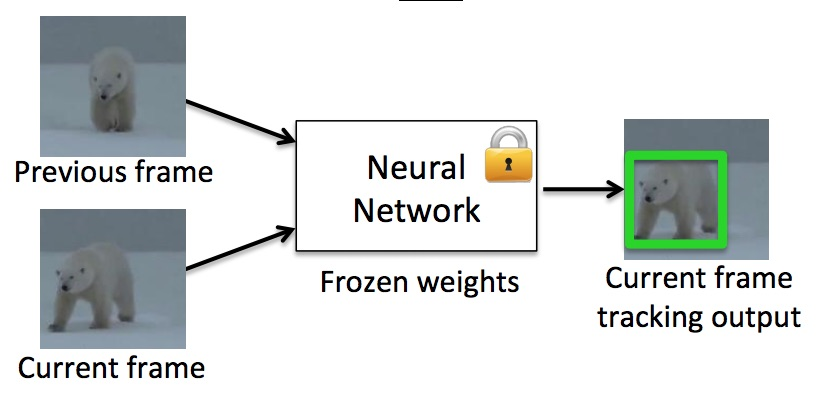

# Multi-Object Tracking using Deep SORT




## Overview

This project implements a real-time multi-object tracking system using the Deep SORT (Simple Online and Realtime Tracking with a Deep Association Metric) algorithm. The system detects multiple objects in a video and maintains their identities across frames by combining motion prediction and deep learning-based appearance features. It is designed to handle challenges such as occlusion, overlapping objects, and dynamic motion, making it suitable for real-world computer vision applications.

---

## Features

* Real-time multi-object tracking
* Unique ID assignment for each object
* Robust tracking under occlusion and crowd scenarios
* Combination of motion (Kalman Filter) and appearance (deep features)
* Efficient object association using the Hungarian Algorithm

---

## How It Works

The system first detects objects in each frame using a pre-trained detection model. These detections are then passed to the Deep SORT tracker, which predicts object positions using a Kalman filter and extracts deep appearance features using a neural network. The tracker matches detected objects with existing tracks using a combination of motion and appearance similarity, ensuring consistent identity assignment across frames.

---

## Requirements

Make sure you have the following installed:

* Python 3.7 or higher
* OpenCV
* NumPy
* TensorFlow or PyTorch (depending on implementation)
* Deep SORT dependencies

Install required libraries using:

```bash
pip install opencv-python numpy
```

(Install additional dependencies as required by your notebook.)

---

## How to Run the Project

1. Clone the repository or download the project files.

2. Navigate to the project directory.

3. Open the notebook:

```bash
jupyter notebook object-tracking-deep-sort.ipynb
```

4. Run all cells in sequence.

5. Provide input:

   * Use a video file or
   * Enable webcam input

6. The output will display tracked objects with bounding boxes and unique IDs in real time.

---

## Project Structure

* `object-tracking-deep-sort.ipynb` → Main implementation file
* `Object_Tracking.ipynb` → Basic tracking methods (reference)
* `readme.md` → Project documentation

---

## Applications

* Surveillance and security systems
* Traffic monitoring
* Autonomous driving
* Crowd analysis
* Sports analytics

---

## Future Improvements

* Integration with advanced detectors like YOLOv8
* Multi-camera tracking
* GPU optimization for faster processing
* Deployment as a web-based application

---

## Conclusion

This project demonstrates an effective approach to multi-object tracking by combining traditional motion models with deep learning-based appearance features. The Deep SORT algorithm significantly improves tracking accuracy and identity consistency, making it suitable for complex and real-time scenarios.

---
